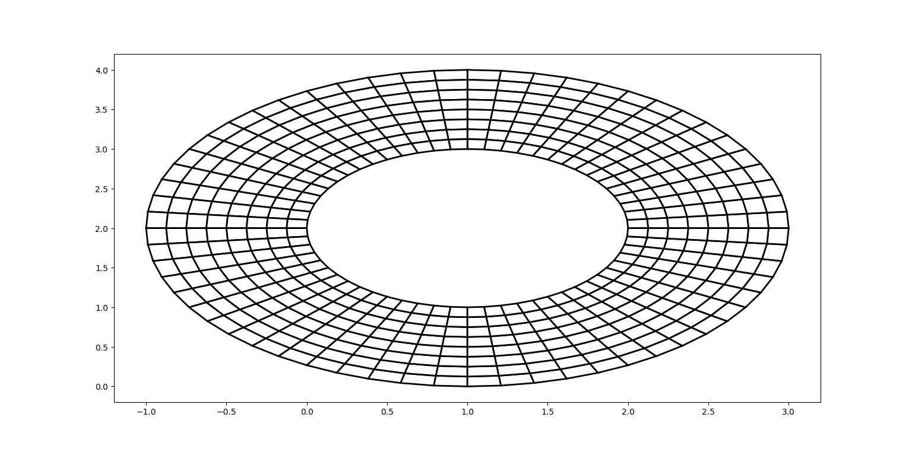

# Курсовой проект по дисциплине "Метод конечных элементов"

### Криволинейные элементы второго порядка с Лагранжевыми функциями формы для двумерного уравнения Пуассона.

## Описание программы

Программа позволяет позволяет решать задачи методом [МКЭ](https://en.wikipedia.org/wiki/Finite_element_method) в областе с криволинейными границами (первого и второго порядка). Также есть возможность задать прямяугольные области c использованием билинейных и биквадратичных базисных функций.

## Внешний вид сетки

